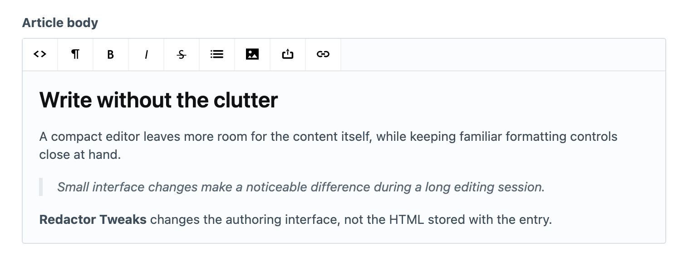

<!-- feature-intro -->
Redactor Tweaks makes small, deliberate adjustments to the editing interface for projects that still use Craft’s [Redactor](https://plugins.craftcms.com/redactor) plugin. Reduce visual bulk and give long editing sessions a more compact workspace.
<!-- feature-intro-end -->

<!-- feature-section media-size="large" media-shadow="false" -->
## A more compact editor

Use a smaller default font, text size, and toolbar controls so the field consumes less space in the control panel. The changes target the authoring interface rather than rewriting the HTML stored by Redactor.

<!-- feature-section-end -->

<!-- feature-section -->
## Consistent Redactor styling

Enable the tweaks at the project level instead of maintaining a custom stylesheet for every Redactor field or control-panel bundle.
<!-- feature-section-end -->
